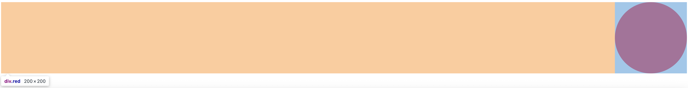
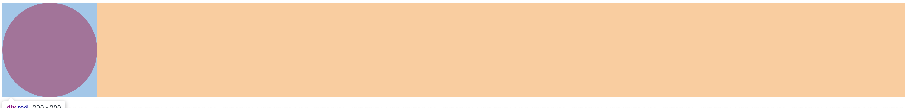
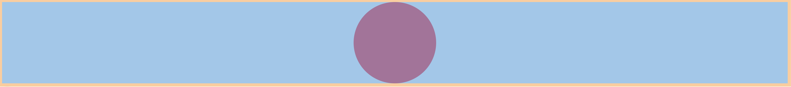
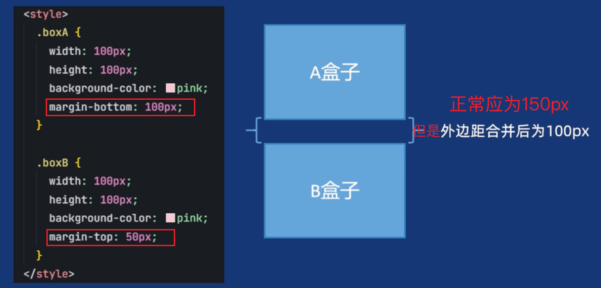
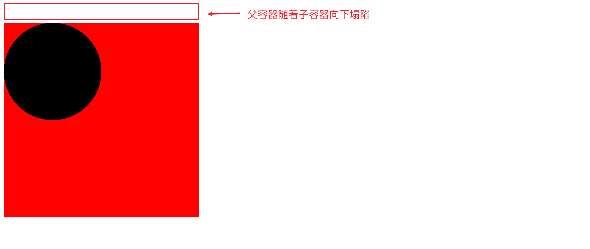
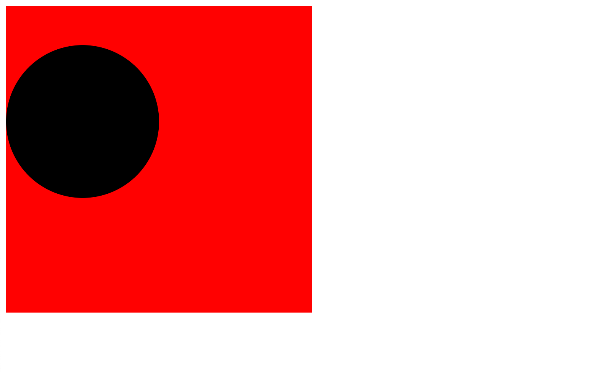
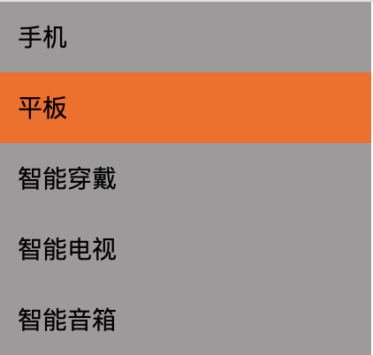
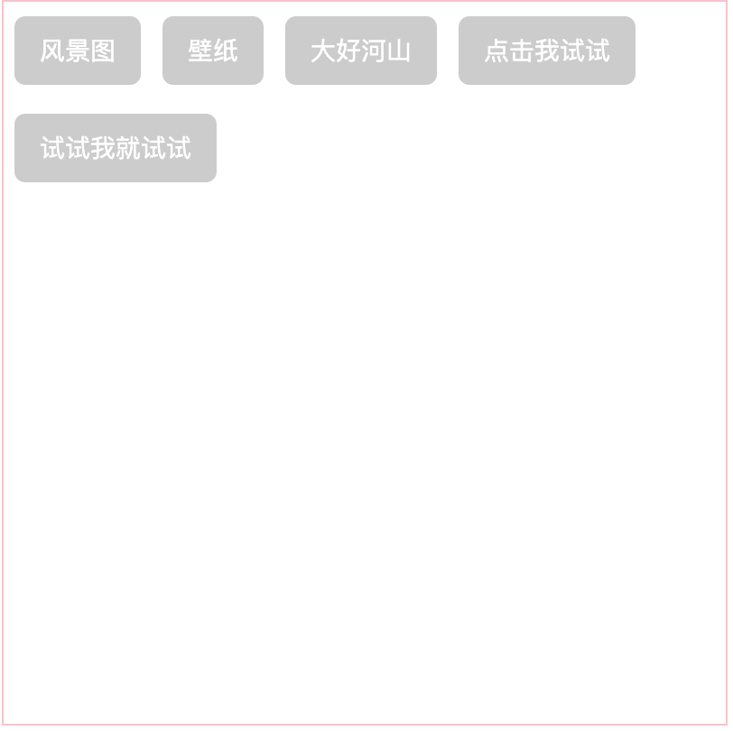

## 区块盒子(block)

- 盒子之间会产生换行
- 可以给盒子设置width和height
- 不设置宽度默认是和父元素空间的100%
- 内边距，外边距和边框会撑大元素
- 常见的块元素有：div，p，h，ul，table等

## 行内盒子(inline)

- 盒子之间不会产生换行，在一行内显示
- width和height都会失效
- 垂直方向的内边距，外边距失效（上下内外边距）
- 水平方向的内边距，外边距会产生效果（左右内外边距）
- 常见的行元素：span，em，a，strong等

## 圆角边框以及原理

元素默认的边框是直角，`border-radius` 通过定义「圆角半径」来改变这一特性。原理类似于：

- 想象在元素的每个角落画一个圆（或椭圆），圆的半径由 `border-radius` 的值决定
- 圆角的曲线就是这个圆与元素边框相交形成的弧线
- 半径越大，圆角越明显；半径等于元素宽 / 高的一半时，可形成圆形或胶囊形

画圆：

```css
/* 如果想实现画圆，width必须与height相等 */
width: 200px;
height: 200px;
/* 将border-radius设置为50% */
border-radius: 50%;
```

实现胶囊形状：

```css
width: 200px;
height: 100px;
/* 如果想实现横向胶囊块，将border-radius设置为width的一半 */
border-radius: 100px;
```

## 外边距，居中对齐

如果想让块级元素水平居中对齐，可以使用margin: auto。原理是：

如果使用margin-left: auto，会将整行的左边以空白占满



如果使用margin-right: auto，会将整行的右边以空白占满



那么直接使用margin: auto，可以使左右两边让空白部分均匀占满，来实现居中显示

```css
div {
  margin: auto;
}
```



### margin外边距折叠合并问题

区块元素上下外边距会出现折叠（合并）情况。
- 并列关系(兄弟）的区块元素。
- 两个上下外边距将合并为一个外边距。其大小等于最大的单个外边距，取最大的外边距，而不是直接相加



解决方案：

1. 仅给boxA设置margin-bottom=150px;
2. 仅给boxB设置margin-top=150px;

```css
.boxA {
	margin-bottom; 150px;
}

.boxB {
	margin-top; 150px;
}
```

### 盒子塌陷问题

区块元素上下外边距会出现塌陷情况。
- 嵌套关系(父子)的区块元素。
- 给子盒子设置上下外边距会让父盒子塌陷移动。

```html
.red {
    width: 400px;
    height: 400px;
    background-color: red;
}

.black {
    width: 200px;
    height: 200px;
    background-color: black;
    border-radius: 50%;
    /* 导致red的整个div也会随着blue的div向下移动 */
    margin-top: 50px;
}
        
<div class="red">
    <div class="black">
    </div>
</div>
```



解决方案:

1. 给父盒子添加上边框。(父盒子本身有边框则不会出现问题)
2. 给父盒子添加上内边距。(同理)
3. 给父盒子添加: overflow: hidden; 属性

```css
.red {
    width: 400px;
    height: 400px;
    background-color: red;
    padding-top: 1px;
}

.blue {
    width: 200px;
    height: 200px;
    background-color: black;
    border-radius: 50%;
    /* 导致red的整个div也会随着blue的div向下移动 */
    margin-top: 50px;
}
```



## 盒子尺寸计算box-sizing

box-sizing 用于定义元素的 盒模型计算方式，控制元素的 width 和 height 是否包含 padding 和 border

- content-box：默认值。元素的 width 和 height 仅包含内容区域，不包含 padding 和 border。理解：width = 内容的宽度
- border-box：元素的 width 和 height 包含内容、padding和 border。理解： width = border + padding + 内容的宽度

## 背景background

| 属性                  | 作用                 | 常用值                                          |
| --------------------- | -------------------- | ----------------------------------------------- |
| background-color      | 设置元素背景颜色     | 颜色名称、十六进制、RGB、透明度                 |
| background-image      | 设置背景图片         | url(image.jpg)                                  |
| background-repeat     | 控制背景图片是否重复 | repeat（默认）、no-repeat、repeat-x、repeat-y   |
| background-position   | 定位背景图片位置     | x y （如 center top，或者px、%单位）            |
| background-size       | 调整背景图片尺寸     | 默认auto、cover（覆盖）、contain（包含）或者跟p |
| background-attachment | 背景是否随页面滚动   | scroll（默认）、fixed（相对于当前屏幕）         |

## 背景渐变

| 属性/方法                                      |            描述            |                           示例代码                           |
| :--------------------------------------------- | :------------------------: | :----------------------------------------------------------: |
| linear-gradient(方向,颜色1 位置,颜色2 位置...) |    线性渐变（方向可控）    | background: linear-gradient(to right, #ff6b6b, #4ecdc4)<br>background-image:linear-gradient(90deg, #ff6b6b 30%, #4ecdc4 70%) |
| radial-gradient(形状,颜色1,颜色2... )          | 径向渐变（形状和位置可控） |          radial-gradient(circle, #ff9a9e, #fad0c4)           |

## 盒子阴影

CSS box-shadow 属性用于在元素的框架上添加阴影效果。

使用场景：
1. 盒子添加阴影，效果更立体。
2. 鼠标经过元素显示阴影，更加突出元素

语法：
box-shadow: X 轴偏移量 Y 轴偏移量 模糊半径 扩散半径 颜色;

- 多个属性用空格隔开
- X轴偏移量和Y轴偏移量是必须要写，其余可以省略采取默认值。
- 默认是外阴影，如果改为内阴影要写 inset

```css
.nav li {
  box-shadow: 0 15px 30px rgba(0,0,0,.1);
}
```

## 盒子文字溢出显示省略号

单行文字溢出显示省略号

```css
/* 文字溢出显示省略号 */
text-overflow: ellipsis;
/* 文字不换行 */
white-space: nowrap;　
/* 元素溢出时隐藏 */
overflow: hidden;
```

多行行文字溢出显示省略号

```css
display: -webkit-box; /* 旧版弹性盒子布局 */
-webkit-box-orient: vertical; /* 文本垂直排列 */
-webkit-line-clamp: 3; /* 限制显示行数 */
overflow: hidden; /* 隐藏溢出内容 */
text-overflow: ellipsis; /* 文本溢出显示省略号 */
```

## CSS精灵技术

使用场景:
1. 导航菜单图标。
2. 按钮操作图标。
3. 复杂彩色小图标更适合精灵图。

优势：
1. 减少 HTTP 请求：多个小图标合并为一张图片，只需一次请求。
2. 提升性能：减少网络开销，尤其适合移动端或低带宽场景。
3. 统一管理：方便维护图标集，避免文件分散。

现将所有的小图标合并为一张图片，通过设置背景图，然后裁剪背景图来显示图标

```css
<style>
    div {
        width: 27px;
        height: 26px;
        background: url("./img/wz.webp") 0 -169px;
    }
</style>
<body>

<div>
</div>
</body>
```

## CSS布局

- 简单布局：优先使用 Flexbox（一维）或 Grid（二维）。
- 复杂响应式布局：使用 Grid + 媒体查询。
- 文本内容分栏：多列布局（column-count）
- 兼容旧浏览器：浮动布局 或 Flexbox 的降级方案。
- CSS Grid 逐渐成为主流，支持更复杂的布局场景。

### CSS正常布局流

正常布局流（normal flow）是指在不对页面进行任何布局控制时，浏览器默认的 HTML 布局方式。也称为标准流。
正常布局流是 CSS 布局的基石，页面大的布局基本就是利用区块元素上下罗列而成。

| 类别              | 特点                                                         | 示例                 |
| ----------------- | ------------------------------------------------------------ | -------------------- |
| 区块元素 (block)  | 独占一行，宽度默认撑满父容器；垂直方向排列，可设置宽高。     | div、p、h1 等        |
| 行内元素 (inline) | 水平方向依次排列，直到容器宽度不足则换行；宽度和高度由内容决定，无法直接设置。 | span、img、strong 等 |
| 文档流方向        | 默认从上到下、从左到右排列。                                 | -                    |

```css
display: block; 转换为区块元素（常用）
display: inline; 转换为行内元素（罕见）
display: inline-block; 转换为行内块元素（较少）既可以显示在同一行。又可以设置宽高
```

#### Display: block

display: block可以将行内元素转为块元素，这样行内元素就可以拥有宽高且都不在一行显示

```html
<div class="xiaomi">
    <a href="">手机</a>
    <a href="">平板</a>
    <a href="">智能穿戴</a>
    <a href="">智能电视</a>
    <a href="">智能音箱</a>
</div>

* {
    margin: 0 auto;
    padding: 0;
    padding: 0;
    font-size: 14px;
    text-decoration: none;
}

.xiaomi a {
    color: black;
    line-height: 40px;
    padding: 0 0 0 10px;
    /* a标签本来是行内元素，使用display: block可以将行内元素转为块元素，这样a元素就可以拥有宽高且都不在一行显示 */
    display: block;
    width: 200px;
    height: 40px;
    list-style: none;
    background: #9D9A9B;
}

.xiaomi a:hover {
    background: #FF6700;
}
```



#### Display: inline-block

inline-block让元素既可以设置宽高，右可以在一行显示

```html
<div class="border">
    <a href="">风景图</a>
    <a href="">壁纸</a>
    <a href="">大好河山</a>
    <a href="">点击我试试</a>
    <a href="">试试我就试试</a>
</div>

.border a {
    margin: 8px 6px;
    color: white;
    /* inline-block让元素既可以设置宽高，右可以在一行显示 */
    display: inline-block;
    height: 30px;
    background: #cccccc;
    line-height: 30px;
    padding: 4px 14px;
    border-radius: 6px;
}

* {
    margin: 0 auto;
    padding: 0;
    padding: 0;
    font-size: 14px;
    text-decoration: none;
}
```



### 浮动float

浮动(float) 可以让元素脱离文档流，向左或向右浮动，直到碰到父容器边缘或其他浮动元素

浮动带来的影响：
1. 父盒子没有高度。（很多情况下不能给父亲指定高度）
2. 子元素浮动。
3. 影响其他盒子布局了。

| 属性值 | 作用           | 示例          |
| ------ | -------------- | ------------- |
| left   | 左侧浮动       | float: left;  |
| right  | 右侧浮动       | float: right; |
| none   | 默认值，不浮动 | float: none;  |

清除浮动也可以理解为闭合浮动，简单来说，就是让浮动的元素尽量控制在父盒子内，不要影响其他盒子。

#### 清除浮动的四种方式

##### 额外标签法

在浮动元素的最后面，新增一个块级标签。添加属性：clear: both;

```html
<div class="header">
    <div class="son1">

    </div>
    <div class="son2">

    </div>

  	/* 添加一个块级的兄弟们标签，对这个兄弟标签设置属性clear: both;，去除浮动 */
    <div class="clearfix"></div>
</div>
<div class="content">

</div>

* {
      margin: 0 auto;
  }

  .header {
      width: 500px;
  }

  .son1 {
      float: left;
      background: skyblue;
      width: 250px;
      height: 250px;
  }

  .son2 {
      float: left;
      background: orange;
      width: 250px;
      height: 250px;
  }

  .content {
      background: black;
      width: 800px;
      height: 200px;
  }

  .clearfix {
      clear: both;
  }
```

##### 单伪元素清除浮动

父元素添加伪元素

```html
<!-- 父元素添加伪元素clearfix -->
<div class="header clearfix">
    <div class="son1">

    </div>
    <div class="son2">

    </div>
</div>
<div class="content">

</div>

* {
      margin: 0 auto;
  }

  .header {
      width: 500px;
  }

  .son1 {
      float: left;
      background: skyblue;
      width: 250px;
      height: 250px;
  }

  .son2 {
      float: left;
      background: orange;
      width: 250px;
      height: 250px;
  }

  .content {
      background: black;
      width: 800px;
      height: 200px;
  }

  /* clearfix设置属性 */
  .clearfix:after {
      visibility: hidden;
      clear: both;
      display: block;
      content: "";
      height: 0;
  }
```

##### 双伪元素清除浮动

父元素添加双伪元素

```html
<!-- 父元素添加伪元素clearfix -->
<div class="header clearfix">
    <div class="son1">

    </div>
    <div class="son2">

    </div>
</div>
<div class="content">

</div>

* {
      margin: 0 auto;
  }

  .header {
      width: 500px;
  }

  .son1 {
      float: left;
      background: skyblue;
      width: 250px;
      height: 250px;
  }

  .son2 {
      float: left;
      background: orange;
      width: 250px;
      height: 250px;
  }

  .content {
      background: black;
      width: 800px;
      height: 200px;
  }

  .clearfix:before, .clearfix:after {
      content: "";
      display: table;
  }

  .clearfix:after {
      clear: both;
  }
```

##### overflow清除浮动

```html
<!-- 父元素添加overflow: hidden -->
<div class="header">
    <div class="son1">

    </div>
    <div class="son2">

    </div>
</div>
<div class="content">

</div>

* {
      margin: 0 auto;
  }

  .header {
			overflow: hidden;
      width: 500px;
  }

  .son1 {
      float: left;
      background: skyblue;
      width: 250px;
      height: 250px;
  }

  .son2 {
      float: left;
      background: orange;
      width: 250px;
      height: 250px;
  }

  .content {
      background: black;
      width: 800px;
      height: 200px;
  }
```

