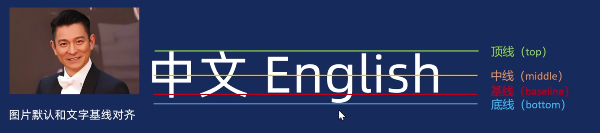

## 弹性盒子

Flexbox 是 CSS 弹性盒子布局模块（Flexible Box Layout Module）的缩写，可以快速实现元素的对齐、分布和空间分配。

弹性盒子核心:
- 父控子(亲父子)
  父盒子控制子盒子如何排列布局
  父盒子称为容器,子盒子称为项目
- 主轴和交叉轴(侧轴)
  主轴默认水平方向,交叉轴默认垂直方向,可以更改

项目（子盒子）属性

| 属性        | 作用                                                      | 示例                          |
| ----------- | --------------------------------------------------------- | ----------------------------- |
| order       | 定义项目的排列顺序（默认 0，数值越小越靠前）              | .item { order: -1; }          |
| flex-grow   | 定义项目的放大比例（默认 0，即不放大）                    | .item { flex-grow: 1; }       |
| flex-shrink | 定义项目的缩小比例（默认 1，空间不足时等比缩小）          | .item { flex-shrink: 0; }     |
| flex-basis  | 定义项目在主轴方向上的初始大小（优先级高于 width/height） | .item { flex-basis: 200px; }  |
| flex        | flex-grow、flex-shrink、flex-basis 的简写                 | .item { flex: 1; }            |
| align-self  | 覆盖容器的 align-items，单独定义某个项目的交叉轴对齐方式  | .item { align-self: center; } |

容器(父盒子)设置 display: flex; 可以让子盒子按照主轴方式排列。
- 如果子元素有大小，则按照给定大小来显示。
- 如果子元素没有大小，则拉伸充满父容器。
- 若子元素总宽度超过容器宽度，默认会压缩子元素。

## justify-content

justify-content 定义主轴(x轴)上的对齐方式

| 属性值        | 效果             | 示例                                       |
| ------------- | ---------------- | ------------------------------------------ |
| flex-start    | 左对齐（默认）   | 子元素靠左排列                             |
| flex-end      | 右对齐           | 子元素靠右排列                             |
| center        | 居中对齐         | 子元素居中                                 |
| space-between | 两端对齐         | 首个子元素放置于起点<br>末尾元素放置于终点 |
| space-around  | 项目两侧间隔相等 | 每个子元素周围分配相同的空间               |
| space-evenly  | 项目间隔均匀分布 | 每个子元素之间的间隔相等                   |

## align-items

align-items 定义侧轴(y轴)上的对齐方式

| 属性值     | 作用描述                                       |
| ---------- | ---------------------------------------------- |
| flex-start | 项目在交叉轴起点对齐（默认值）                 |
| flex-end   | 项目在交叉轴终点对齐                           |
| center     | 项目在交叉轴居中对齐                           |
| stretch    | 项目拉伸填充整个容器高度（需子项目无固定高度） |

## flex-direction(定义x轴的方向, 交叉轴自动变换)

| 属性值           | 描述                                       | 示例效果                    | 代码示例                                       |
| ---------------- | ------------------------------------------ | --------------------------- | ---------------------------------------------- |
| row              | 默认值。子元素沿水平主轴（从左到右）排列。 | A B C（横向排列）           | .container { flex-direction: row; }            |
| row - reverse    | 子元素沿水平主轴反向排列（从右到左）。     | C B A（反向横向排列）       | .container { flex-direction: row-reverse; }    |
| column           | 子元素沿垂直主轴（从上到下）排列。         | A<br>B<br>C（纵向排列）     | .container { flex-direction: column; }         |
| column - reverse | 子元素沿垂直主轴反向排列（从下到上）。     | C<br>B<br>A（反向纵向排列） | .container { flex-direction: column-reverse; } |

## align-content 

定义多行时交叉轴上的对齐方式（仅当 flex-wrap: wrap 且内容换行时生效）

| 属性值        | 效果             | 示例                                       |
| ------------- | ---------------- | ------------------------------------------ |
| flex-start    | 上对齐           | 子元素靠上排列                             |
| flex-end      | 下对齐           | 子元素靠下排列                             |
| center        | 居中对齐         | 子元素居中                                 |
| space-between | 两端对齐         | 首个子元素放置于起点<br>末尾元素放置于终点 |
| space-around  | 项目两侧间隔相等 | 每个子元素周围分配相同的空间               |
| space-evenly  | 项目间隔均匀分布 | 每个子元素之间的间隔相等                   |

## flex

子元素的属性用于控制自身的尺寸、顺序或对齐方式

语法：
flex: 1; 剩余空间占1份，并且可以伸缩盒子大小
数字表示剩余空间所占份数。正整数

| 属性        | 作用                                                         | 示例                          |
| ----------- | ------------------------------------------------------------ | ----------------------------- |
| flex-grow   | 定义子元素剩余空间分配放大比例<br />(默认 0，即不放大）      | .item { flex-grow: 1; }       |
| flex-shrink | 定义子元素剩余空间分配缩小比例<br />(默认 1，空间不足时等比缩小， 0 为不缩小） | .item { flex-shrink: 0; }     |
| flex-basis  | 定义项目在主轴方向上的初始大小<br />(默认auto，优先级高于 width/height） | .item { flex-basis: 200px; }  |
| flex        | flex-grow、flex-shrink、flex-basis 的简写<br />flex: 1→ 1 1 0% (等比放大/收缩，初始无基准尺寸)<br />flex: 2→ 2 1 0% (等比放大/收缩，初始无基准尺寸) | .item { flex: 1; }            |
| align-self  | 覆盖容器的 align-items，单独定义某个项目的交叉轴对齐方式     | .item { align-self: center; } |
| order       | 定义项目的排列顺序（默认 0，数值越小越靠前）                 | .item { order: -1; }          |

## gap间距

gap 简写属性用于设置行与列之间的间隙（间距）

gap是写到父元素身上

```css
.father {
    gap: 20px; 行和列之间保持20像素间隙。
    gap: 20px 30px; 行间距是20像素，列间距是30像素。
}
```

## 垂直对齐-解决图片底部空白缝隙问题

基线：浏览器行内元素（行内块元素）排版中存在用于对齐的基线（baseline）

图片默认和文字的极限对齐，如果不做处理，图片的底部会有一部分空白区域



|  属性值  |      效果      |
| :------: | :------------: |
| baseline | 默认，基线对齐 |
|   top    |    顶部对齐    |
|  middle  |    中部对齐    |
|  bottom  |    底部对齐    |

```css
.box .item a img {
    /* 解决方式1：将图片转换为块级元素 */
    display: block;
  	/* 解决方式1：将图片的对齐方式设置为非基线对齐 */
  	vertical-align: bottom;
    width: 100%;
}
```

